# centos7静默安装oracle11gR2

## 文章目录

[TOC]

## 一、检查硬件要求


### 1、内存要求：

要求：内存最小1G，推荐2G或者更高。

```shell
#查看命令,下列是我的内存
[root@centos7l opt]# grep MemTotal /proc/meminfo
MemTotal:         995924 kB
```

PS：还有其他硬件要求可以直接去官网([传送门](https://docs.oracle.com/cd/E11882_01/install.112/e47689/pre_install.htm#LADBI1098))查看，这里不再叙述。


### 2、安装包：

- linux.x64_11gR2_database_1of2.zip

- linux.x64_11gR2_database_2of2.zip

  PS:官方下载地址：[传送门](https://www.oracle.com/technetwork/cn/database/enterprise-edition/downloads/index.html)；
  
  [服务器无法访问互联网所需离线软件包](https://pan.baidu.com/s/1JsCmtzGlv_QvLBVNxXkDmw)
  
  https://pan.baidu.com/s/1JsCmtzGlv_QvLBVNxXkDmw

## 二、环境准备


### 1、安装必要的工具

```shell
#wget：下载工具；zip：打包工具；unzip：解压工具
[root@centos7l ~]# yum -y install wget zip unzip xterm xorg-x11-xauth vim

已安装:
  unzip.x86_64 0:6.0-20.el7  wget.x86_64 0:1.14-18.el7_6.1  xorg-x11-xauth.x86_64 1:1.0.9-1.el7
  xterm.x86_64 0:295-3.el7   zip.x86_64 0:3.0-11.el7

作为依赖被安装:
  dejavu-fonts-common.noarch 0:2.33-6.el7       dejavu-sans-fonts.noarch 0:2.33-6.el7
  fontconfig.x86_64 0:2.13.0-4.3.el7            fontpackages-filesystem.noarch 0:1.44-8.el7
  libICE.x86_64 0:1.0.9-9.el7                   libSM.x86_64 0:1.2.2-2.el7
  libX11.x86_64 0:1.6.7-2.el7                   libX11-common.noarch 0:1.6.7-2.el7
  libXau.x86_64 0:1.0.8-2.1.el7                 libXaw.x86_64 0:1.0.13-4.el7
  libXext.x86_64 0:1.3.3-3.el7                  libXft.x86_64 0:2.3.2-2.el7
  libXmu.x86_64 0:1.1.2-2.el7                   libXpm.x86_64 0:3.5.12-1.el7
  libXrender.x86_64 0:0.9.10-1.el7              libXt.x86_64 0:1.1.5-3.el7
  libxcb.x86_64 0:1.13-1.el7

```

- PS：如果已经有了就不需重复安装，xorg-x11-xauth是一个远程视窗程序


### 2、关闭防火墙

```shell
#查看防火墙状态
[root@centos7 ~]# systemctl status firewalld
● firewalld.service - firewalld - dynamic firewall daemon
   Loaded: loaded (/usr/lib/systemd/system/firewalld.service; enabled; vendor preset: enabled)
   Active: active (running) since 四 2020-04-09 16:21:51 CST; 7h left
     Docs: man:firewalld(1)
 Main PID: 6094 (firewalld)
   CGroup: /system.slice/firewalld.service
           └─6094 /usr/bin/python -Es /usr/sbin/firewalld --nofork --nopid

4月 09 16:21:50 localhost.localdomain systemd[1]: Starting firewalld - dynamic firewall daemon...
4月 09 16:21:51 localhost.localdomain systemd[1]: Started firewalld - dynamic firewall daemon.
Hint: Some lines were ellipsized, use -l to show in full.

#关闭防火墙
[root@centos7l ~]# systemctl stop firewalld

#禁用防火墙
[root@centos7l ~]# systemctl disable firewalld
Removed symlink /etc/systemd/system/multi-user.target.wants/firewalld.service.
Removed symlink /etc/systemd/system/dbus-org.fedoraproject.FirewallD1.service.

#确认防火墙状态
[root@centos7l ~]# systemctl status firewalld
● firewalld.service - firewalld - dynamic firewall daemon
   Loaded: loaded (/usr/lib/systemd/system/firewalld.service; disabled; vendor preset: enabled)
   Active: inactive (dead)
     Docs: man:firewalld(1)

3月 04 14:31:15 localhost.localdomain systemd[1]: Starting firewalld - dynamic firewall daemon...
3月 04 14:31:15 localhost.localdomain systemd[1]: Started firewalld - dynamic firewall daemon.
3月 04 14:36:34 centos7l.micserver systemd[1]: Stopping firewalld - dynamic firewall daemon...
3月 04 14:36:35 centos7l.micserver systemd[1]: Stopped firewalld - dynamic firewall daemon.
```

- PS：不关闭防火墙，远程连接会提示连接超时，也可以通过开放对应端口如下


```shell
[root@centos7 ~]# firewall-cmd --permanent --zone=public --add-port=1521/tcp
success
[root@centos7 ~]# firewall-cmd --reload
success
[root@centos7 ~]# firewall-cmd --zone=public --list-ports
1521/tcp
[root@centos7 ~]#
```


### 3、关闭Selinux

```shell
[root@centos7 ~]# sed -i "s/SELINUX=enforcing/SELINUX=disabled/" /etc/selinux/config
[root@centos7 ~]# setenforce 0
#查看Selinux状态
[root@centos7 ~]# /usr/sbin/sestatus -v
SELinux status:                 enabled
SELinuxfs mount:                /sys/fs/selinux
SELinux root directory:         /etc/selinux
Loaded policy name:             targeted
Current mode:                   permissive
Mode from config file:          disabled
Policy MLS status:              enabled
Policy deny_unknown status:     allowed
Max kernel policy version:      31

Process contexts:
Current context:                unconfined_u:unconfined_r:unconfined_t:s0-s0:c0.c1023
Init context:                   system_u:system_r:init_t:s0
/usr/sbin/sshd                  system_u:system_r:sshd_t:s0-s0:c0.c1023

File contexts:
Controlling terminal:           unconfined_u:object_r:user_devpts_t:s0
/etc/passwd                     system_u:object_r:passwd_file_t:s0
/etc/shadow                     system_u:object_r:shadow_t:s0
/bin/bash                       system_u:object_r:shell_exec_t:s0
/bin/login                      system_u:object_r:login_exec_t:s0
/bin/sh                         system_u:object_r:bin_t:s0 -> system_u:object_r:shell_exec_t:s0
/sbin/agetty                    system_u:object_r:getty_exec_t:s0
/sbin/init                      system_u:object_r:bin_t:s0 -> system_u:object_r:init_exec_t:s0
/usr/sbin/sshd                  system_u:object_r:sshd_exec_t:s0

```


### 4、安装Oracle依赖包

```shell
#通过安装Oracle YUM 源来安装所依赖的包
[root@centos7l ~]# cd /etc/yum.repos.d 
[root@centos7l yum.repos.d]# wget http://public-yum.oracle.com/public-yum-ol7.repo

#导入RPM-GPG-KEY-oracle
[root@centos7l yum.repos.d]# wget http://public-yum.oracle.com/RPM-GPG-KEY-oracle-ol7 -O /etc/pki/rpm-gpg/RPM-GPG-KEY-oracle

#安装oracle-rdbms-server-11gR2-preinstall快速配置Oracle安装环境
[root@centos7l yum.repos.d]# yum install oracle-rdbms-server-11gR2-preinstall -y

已安装:
  oracle-rdbms-server-11gR2-preinstall.x86_64 0:1.0-6.el7

作为依赖被安装:
  bc.x86_64 0:1.06.95-13.el7
  bind-export-libs.x86_64 32:9.11.4-16.P2.el7
  bind-libs.x86_64 32:9.11.4-16.P2.el7
  bind-utils.x86_64 32:9.11.4-16.P2.el7
  compat-libcap1.x86_64 0:1.10-7.el7
  compat-libstdc++-33.x86_64 0:3.2.3-72.el7
  cpp.x86_64 0:4.8.5-39.0.3.el7
  gcc.x86_64 0:4.8.5-39.0.3.el7
  gcc-c++.x86_64 0:4.8.5-39.0.3.el7
  glibc-devel.x86_64 0:2.17-307.0.1.el7.1
  glibc-headers.x86_64 0:2.17-307.0.1.el7.1
  gssproxy.x86_64 0:0.7.0-28.el7
  kernel-container.x86_64 0:3.10.0-0.0.0.2.el7
  kernel-headers.x86_64 0:3.10.0-1127.el7
  keyutils.x86_64 0:1.5.8-3.el7
  ksh.x86_64 0:20120801-142.0.1.el7
  libXi.x86_64 0:1.7.9-1.el7
  libXinerama.x86_64 0:1.1.3-2.1.el7
  libXrandr.x86_64 0:1.5.1-2.el7
  libXtst.x86_64 0:1.2.3-1.el7
  libXv.x86_64 0:1.0.11-1.el7
  libXxf86dga.x86_64 0:1.1.4-2.1.el7
  libXxf86misc.x86_64 0:1.0.3-7.1.el7
  libXxf86vm.x86_64 0:1.1.4-1.el7
  libaio-devel.x86_64 0:0.3.109-13.el7
  libbasicobjects.x86_64 0:0.1.1-32.el7
  libcollection.x86_64 0:0.7.0-32.el7
  libdmx.x86_64 0:1.1.3-3.el7
  libevent.x86_64 0:2.0.21-4.el7
  libini_config.x86_64 0:1.3.1-32.el7
  libmpc.x86_64 0:1.0.1-3.el7
  libnfsidmap.x86_64 0:0.25-19.el7
  libpath_utils.x86_64 0:0.2.1-32.el7
  libref_array.x86_64 0:0.1.5-32.el7
  libstdc++-devel.x86_64 0:4.8.5-39.0.3.el7
  libtirpc.x86_64 0:0.2.4-0.16.el7
  libverto-libevent.x86_64 0:0.2.5-4.el7
  lm_sensors-libs.x86_64 0:3.4.0-8.20160601gitf9185e5.el7
  mailx.x86_64 0:12.5-19.el7
  mpfr.x86_64 0:3.1.1-4.el7
  nfs-utils.x86_64 1:1.3.0-0.66.0.1.el7
  psmisc.x86_64 0:22.20-16.el7
  quota.x86_64 1:4.01-19.el7
  quota-nls.noarch 1:4.01-19.el7
  rpcbind.x86_64 0:0.2.0-49.el7
  smartmontools.x86_64 1:7.0-2.el7
  sysstat.x86_64 0:10.1.5-19.el7
  tcp_wrappers.x86_64 0:7.6-77.el7
  xorg-x11-utils.x86_64 0:7.5-23.el7

作为依赖被升级:
  bind-libs-lite.x86_64 32:9.11.4-16.P2.el7        bind-license.noarch 32:9.11.4-16.P2.el7
  dhclient.x86_64 12:4.2.5-79.0.1.el7              dhcp-common.x86_64 12:4.2.5-79.0.1.el7
  dhcp-libs.x86_64 12:4.2.5-79.0.1.el7             glibc.x86_64 0:2.17-307.0.1.el7.1
  glibc-common.x86_64 0:2.17-307.0.1.el7.1         libgcc.x86_64 0:4.8.5-39.0.3.el7
  libgomp.x86_64 0:4.8.5-39.0.3.el7                libstdc++.x86_64 0:4.8.5-39.0.3.el7

#安装完后查看后台日志内容
[root@centos7l yum.repos.d]# more /var/log/oracle-rdbms-server-11gR2-preinstall/results/orakernel.log
```

```shell
#离线安装方式
[root@centos7l oracle-rdbms-server-11gR2-preinstall]# yum localinstall *.rpm
```

- PS：#oracle-rdbms-server-11gR2-preinstall包所干的事情


```
（1）自动安装oracle所需的RPM包
（2）自动创建oracle用户和group组
（3）自动配置/etc/sysctl.conf内核参数
（4）自动配置/etc/security/limits.conf参数
```

## 三、安装前配置


### 1、修改oracle用户密码

```shell
#修改oracl用户密码
[root@centos7l oracle-rdbms-server-11gR2-preinstall]# passwd oracle
更改用户 oracle 的密码 。
新的 密码：
无效的密码： 密码少于 8 个字符
重新输入新的 密码：
passwd：所有的身份验证令牌已经成功更新。
```


### 2、用Oracle登录用户

```shell
#重新打开一个bash切换为Oracle用户登录系统
[oracle@centos7l ~]$
```


### 3、上传安装包到服务器

```shell
#上传安装包到服务器
[oracle@centos7l ~]$ ll
总用量 2295592
-rw-r--r-- 1 oracle oinstall 1239269270 9月  29 15:48 linux.x64_11gR2_database_1of2.zip
-rw-r--r-- 1 oracle oinstall 1111416131 9月  29 15:49 linux.x64_11gR2_database_2of2.zip
```


### 4、解压oracle安装包

```shell
#解压安装包
[oracle@centos7l ~]$ unzip linux.x64_11gR2_database_1of2.zip
[oracle@centos7l ~]$ unzip linux.x64_11gR2_database_2of2.zip
[oracle@centos7l ~]$ ll
总用量 2295592
drwxr-xr-x 8 oracle oinstall        128 8月  21 2009 database
-rw-r--r-- 1 oracle oinstall 1239269270 9月  29 15:48 linux.x64_11gR2_database_1of2.zip
-rw-r--r-- 1 oracle oinstall 1111416131 9月  29 15:49 linux.x64_11gR2_database_2of2.zip
[oracle@centos7l ~]$
```


### 5、配置oracle用户环境变量

```shell
#配置环境变量
[oracle@centos7l ~]$ vim .bash_profile

#增加
export ORACLE_BASE=/home/oracle/app/oracle
export ORACLE_HOME=/home/oracle/app/oracle/product/11.2.0/dbhome_1
export ORACLE_SID=orcl
export PATH=$ORACLE_HOME/bin:$PATH
export LANG=en_US.utf8

#立即生效配置文件
[oracle@centos7l ~]$ source .bash_profile

```

## 四、开始安装


### 1、运行安装程序


```shell
#运行安装程序
[oracle@centos7 ~]$ cd database/
[oracle@centos7 database]$ ll
total 16
drwxr-xr-x. 12 oracle oinstall  203 Aug 17  2009 doc
drwxr-xr-x.  4 oracle oinstall  223 Aug 15  2009 install
drwxrwxr-x.  2 oracle oinstall   61 Aug 15  2009 response
drwxr-xr-x.  2 oracle oinstall   34 Aug 15  2009 rpm
-rwxr-xr-x.  1 oracle oinstall 3226 Aug 15  2009 runInstaller
drwxrwxr-x.  2 oracle oinstall   29 Aug 15  2009 sshsetup
drwxr-xr-x. 14 oracle oinstall 4096 Aug 15  2009 stage
-rw-r--r--.  1 oracle oinstall 5402 Aug 18  2009 welcome.html

[oracle@centos7l database]$ ./runInstaller
Starting Oracle Universal Installer...

Checking Temp space: must be greater than 120 MB.   Actual 11210 MB    Passed
Checking swap space: must be greater than 150 MB.   Actual 2047 MB    Passed
Checking monitor: must be configured to display at least 256 colors.    Actual 16777216    Passed
Preparing to launch Oracle Universal Installer from /tmp/OraInstall2019-09-29_04-00-57PM. Please wait ...[oracle@centos7l database]$
#确保安装x11(xorg-x11-xauth)才能出现窗口
```


### 2、反选I wish to receive security updates via My Oracle Support 

**点击next**


### 4、选择yes
**点击yes**


### 5、选择创建并配置数据库（create and configure a database）

**点击next**


### 6、选择server class

点击**next**


### 7、选择单实例安装

点击**next**


### 8、可以选择 [典型安装]() 也可以选择 [高级安装]()

我这里选择的是**典型安装**

点击**next**

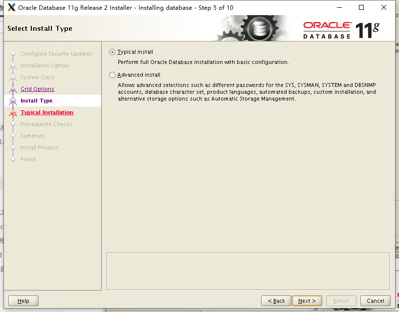


### 9、以下是默认生成的安装路径，如果不会配置只需配置密码即可

点击**next**

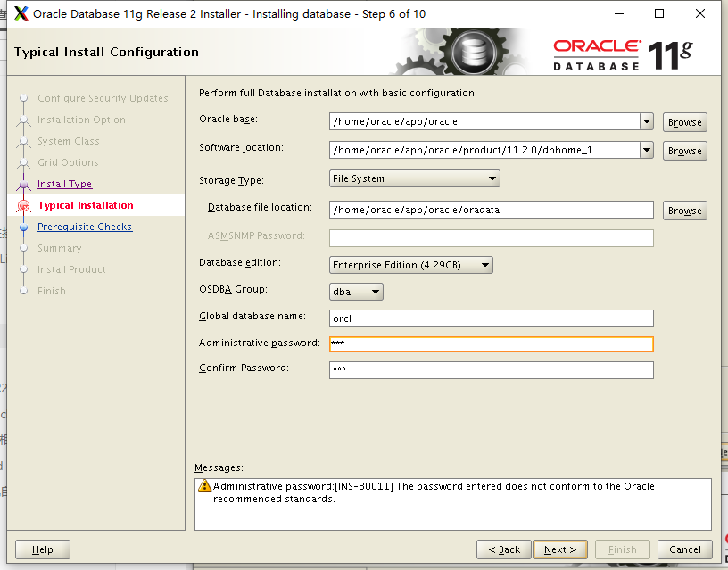


密码不符合规范点击**yes**即可

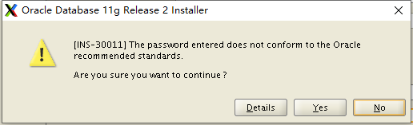


默认路径即可

- 点击**next**

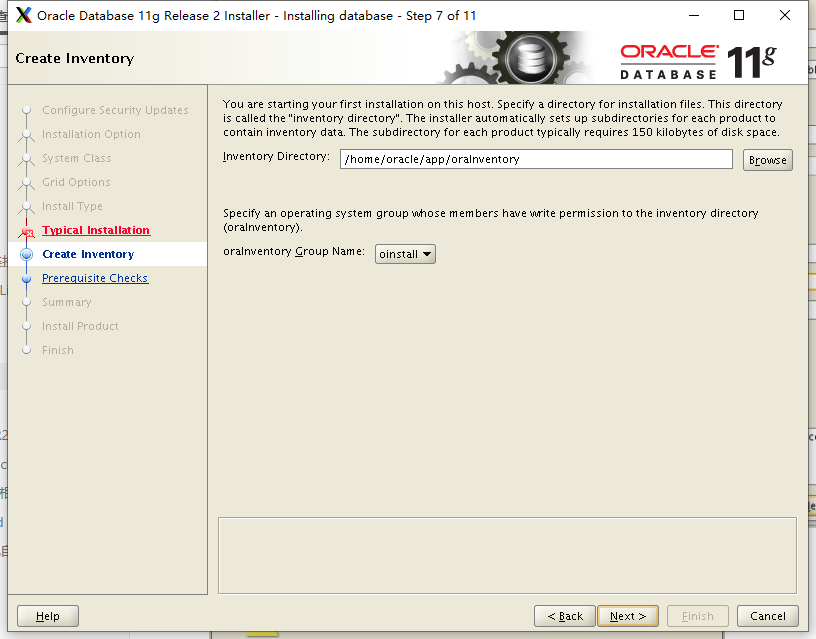


### 10、生成响应文件


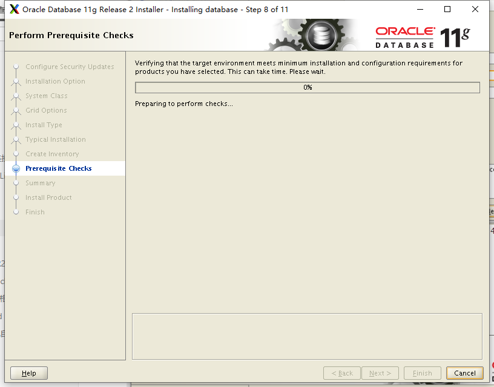


- 有检测失败的**忽略**即可


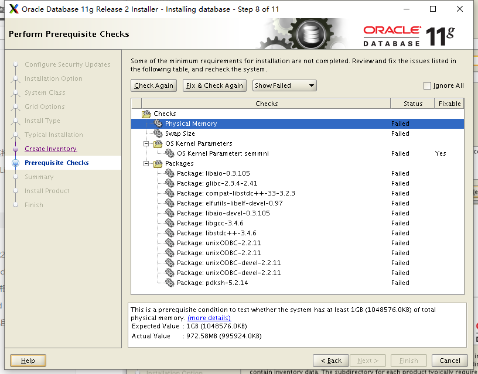


- 勾选 **ignore all**

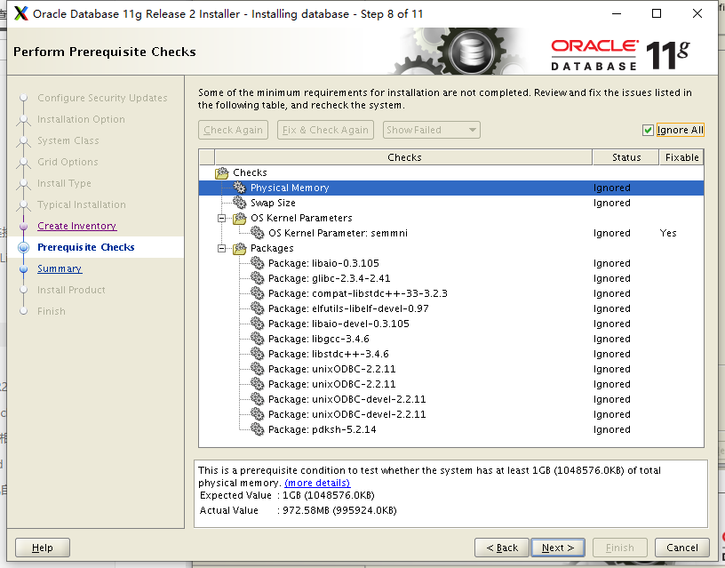


- 可选保存**响应文件**

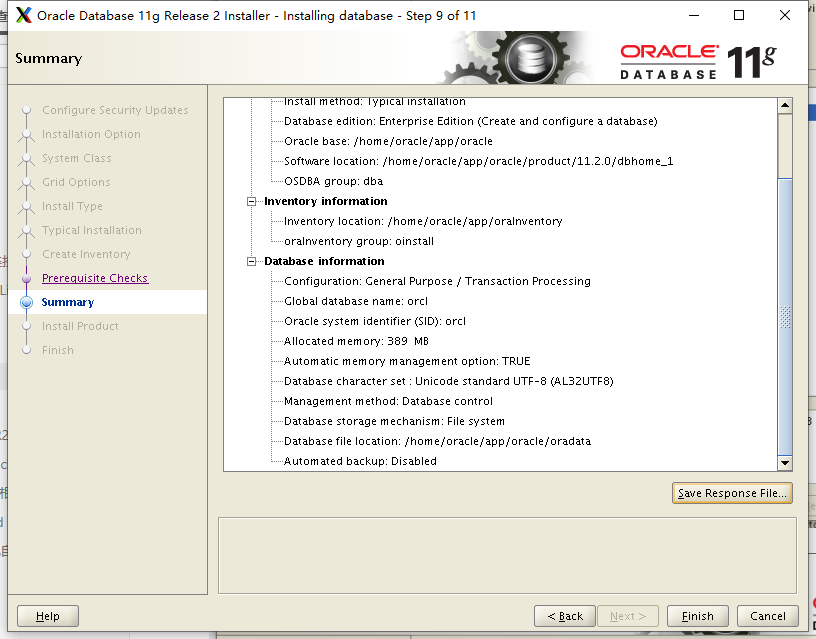


### 11、开始安装显示安装进度

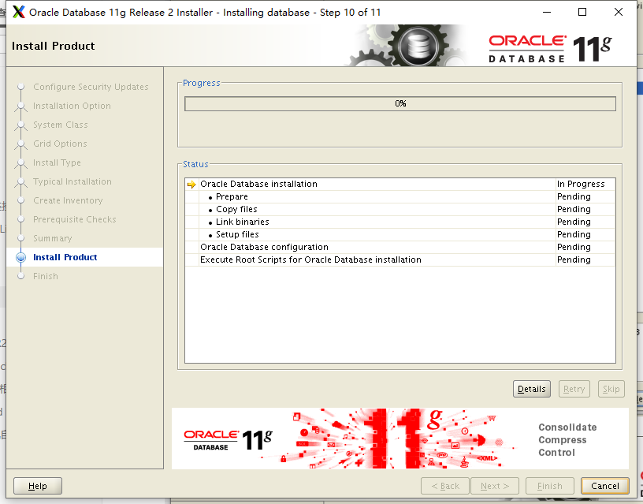


### 12、如果安装过程中，在link binaries阶段出现2个错误


```shell
#第一个是关于ins_ctx.mk，log显示：
/lib64/libstdc++.so.5: undefined reference to `memcpy@GLIBC_2.14'

#原因据说是由于本机的glibc版本高于2.14（实际为2.17）。解决方法：
[root@centos7 CVU_11.2.0.1.0_oracle]# yum install glibc-static --skip-broken
已加载插件：fastestmirror
Loading mirror speeds from cached hostfile
 * base: mirrors.huaweicloud.com
 * extras: mirrors.huaweicloud.com
 * updates: mirrors.huaweicloud.com
正在解决依赖关系
--> 正在检查事务
---> 软件包 glibc-static.x86_64.0.2.17-292.el7 将被 安装
--> 正在处理依赖关系 glibc-devel = 2.17-292.el7，它被软件包 glibc-static-2.17-292.el7.x86_64 需要
--> 正在检查事务
---> 软件包 glibc-devel.i686.0.2.17-292.el7 将被 安装
--> 正在处理依赖关系 glibc-headers = 2.17-292.el7，它被软件包 glibc-devel-2.17-292.el7.i686 需要
--> 正在处理依赖关系 glibc = 2.17-292.el7，它被软件包 glibc-devel-2.17-292.el7.i686 需要
--> 正在处理依赖关系 libutil.so.1，它被软件包 glibc-devel-2.17-292.el7.i686 需要
--> 正在处理依赖关系 libthread_db.so.1，它被软件包 glibc-devel-2.17-292.el7.i686 需要
--> 正在处理依赖关系 librt.so.1，它被软件包 glibc-devel-2.17-292.el7.i686 需要
--> 正在处理依赖关系 libresolv.so.2，它被软件包 glibc-devel-2.17-292.el7.i686 需要
--> 正在处理依赖关系 libnss_nisplus.so.2，它被软件包 glibc-devel-2.17-292.el7.i686 需要
--> 正在处理依赖关系 libnss_nis.so.2，它被软件包 glibc-devel-2.17-292.el7.i686 需要
--> 正在处理依赖关系 libnss_hesiod.so.2，它被软件包 glibc-devel-2.17-292.el7.i686 需要
--> 正在处理依赖关系 libnss_files.so.2，它被软件包 glibc-devel-2.17-292.el7.i686 需要
--> 正在处理依赖关系 libnss_dns.so.2，它被软件包 glibc-devel-2.17-292.el7.i686 需要
--> 正在处理依赖关系 libnss_db.so.2，它被软件包 glibc-devel-2.17-292.el7.i686 需要
--> 正在处理依赖关系 libnss_compat.so.2，它被软件包 glibc-devel-2.17-292.el7.i686 需要
--> 正在处理依赖关系 libnsl.so.1，它被软件包 glibc-devel-2.17-292.el7.i686 需要
--> 正在处理依赖关系 libm.so.6，它被软件包 glibc-devel-2.17-292.el7.i686 需要
--> 正在处理依赖关系 libdl.so.2，它被软件包 glibc-devel-2.17-292.el7.i686 需要
--> 正在处理依赖关系 libcrypt.so.1，它被软件包 glibc-devel-2.17-292.el7.i686 需要
--> 正在处理依赖关系 libcidn.so.1，它被软件包 glibc-devel-2.17-292.el7.i686 需要
--> 正在处理依赖关系 libanl.so.1，它被软件包 glibc-devel-2.17-292.el7.i686 需要
--> 正在处理依赖关系 libBrokenLocale.so.1，它被软件包 glibc-devel-2.17-292.el7.i686 需要
--> 正在检查事务
---> 软件包 glibc.i686.0.2.17-292.el7 将被 安装
--> 正在处理依赖关系 glibc-common = 2.17-292.el7，它被软件包 glibc-2.17-292.el7.i686 需要
--> 正在处理依赖关系 libfreebl3.so(NSSRAWHASH_3.12.3)，它被软件包 glibc-2.17-292.el7.i686 需要
--> 正在处理依赖关系 libfreebl3.so，它被软件包 glibc-2.17-292.el7.i686 需要
---> 软件包 glibc-devel.i686.0.2.17-292.el7 将被 安装
--> 正在处理依赖关系 glibc-headers = 2.17-292.el7，它被软件包 glibc-devel-2.17-292.el7.i686 需要
--> 正在检查事务
---> 软件包 glibc.i686.0.2.17-292.el7 将被 安装
--> 正在处理依赖关系 glibc-common = 2.17-292.el7，它被软件包 glibc-2.17-292.el7.i686 需要
---> 软件包 glibc-devel.i686.0.2.17-292.el7 将被 安装
--> 正在处理依赖关系 glibc-headers = 2.17-292.el7，它被软件包 glibc-devel-2.17-292.el7.i686 需要
---> 软件包 nss-softokn-freebl.x86_64.0.3.36.0-5.el7_5 将被 升级
---> 软件包 nss-softokn-freebl.i686.0.3.44.0-8.0.1.el7_7 将被 安装
--> 正在处理依赖关系 nss-util >= 3.44.0-3，它被软件包 nss-softokn-freebl-3.44.0-8.0.1.el7_7.i686 需要
--> 正在处理依赖关系 nspr >= 4.21.0，它被软件包 nss-softokn-freebl-3.44.0-8.0.1.el7_7.i686 需要
---> 软件包 nss-softokn-freebl.x86_64.0.3.44.0-8.0.1.el7_7 将被 更新
--> 正在检查事务
---> 软件包 glibc.i686.0.2.17-292.el7 将被 安装
--> 正在处理依赖关系 glibc-common = 2.17-292.el7，它被软件包 glibc-2.17-292.el7.i686 需要
---> 软件包 glibc-devel.i686.0.2.17-292.el7 将被 安装
--> 正在处理依赖关系 glibc-headers = 2.17-292.el7，它被软件包 glibc-devel-2.17-292.el7.i686 需要
---> 软件包 nspr.x86_64.0.4.19.0-1.el7_5 将被 升级
---> 软件包 nspr.x86_64.0.4.21.0-1.el7 将被 更新
---> 软件包 nss-util.x86_64.0.3.36.0-1.el7_5 将被 升级
---> 软件包 nss-util.x86_64.0.3.44.0-4.el7_7 将被 更新

因为依赖关系问题而跳过的软件包：
    glibc-2.17-292.el7.i686 来自 base
    glibc-devel-2.17-292.el7.i686 来自 base
    glibc-static-2.17-292.el7.x86_64 来自 base
    nspr-4.21.0-1.el7.x86_64 来自 base
    nss-softokn-freebl-3.44.0-8.0.1.el7_7.i686 来自 ol7_latest
    nss-softokn-freebl-3.44.0-8.0.1.el7_7.x86_64 来自 ol7_latest
    nss-util-3.44.0-4.el7_7.x86_64 来自 ol7_latest


#该软件包包含一个静态链接库：/usr/lib64/libc.a

#修改/home/oracle/app/oracle/product/11.2.0/dbhome_1/ctx/lib/ins_ctx.mk，

[root@centos7l oracle-rdbms-server-11gR2-preinstall]# vim /home/oracle/app/oracle/product/11.2.0/dbhome_1/ctx/lib/ins_ctx.mk

#将

ctxhx: $(CTXHXOBJ)
       $(LINK_CTXHX) $(CTXHXOBJ) $(INSO_LINK)

#修改为：

ctxhx: $(CTXHXOBJ)
       -static $(LINK_CTXHX) $(CTXHXOBJ) $(INSO_LINK) /usr/lib64/stdc.a

#点击Retry即可。
```


```shell
#第二个错误是”Error in invoking target 'agent nmhs' of makefile'/app/oracle/product/11.2.0/db_1/sysman/lib/ins_emagent.mk.' 

#解决方法，在makefile中添加链接libnnz11库的参数：

#修改/home/oracle/app/oracle/product/11.2.0/dbhome_1/sysman/lib/ins_emagent.mk，
[root@centos7l oracle-rdbms-server-11gR2-preinstall]# vim /home/oracle/app/oracle/product/11.2.0/dbhome_1/sysman/lib/ins_emagent.mk

#将

$(MK_EMAGENT_NMECTL)

#修改为：

$(MK_EMAGENT_NMECTL) -lnnz11

#点击Retry即可。
```

- PS 修改上述两个文件需要打开新bash，并用Oracle用户登录

  

- 按上述修改完相关文件**retry**即可

  


- 继续安装


### 13、如果没有配置**hosts**会出现如下错误


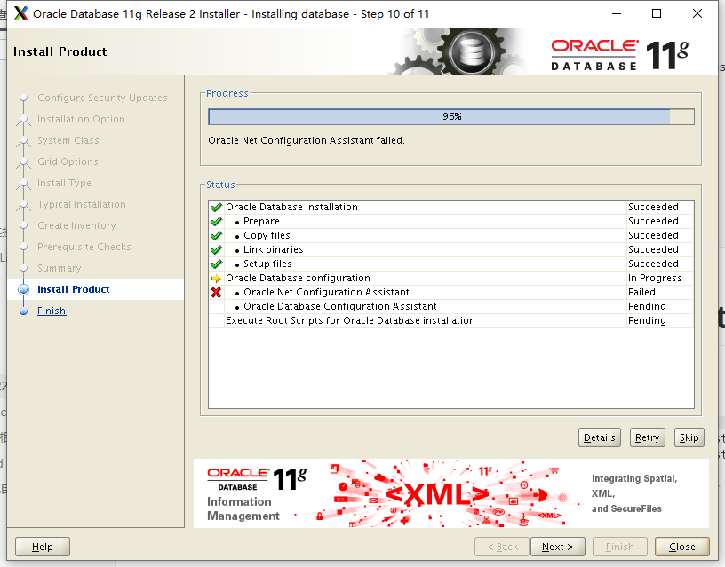

```shell
#只需修改hosts文件retry即可 根据实际情况修改host的IP和host名称
[root@centos7l oracle-rdbms-server-11gR2-preinstall]# vim /etc/hosts
127.0.0.1   localhost localhost.localdomain localhost4 localhost4.localdomain4
::1         localhost localhost.localdomain localhost6 localhost6.localdomain6
192.168.131.7 centos7
```

- 继续安装


### 14、接下来会自动创建数据库


- 安装成功点击**ok**即可


- 接下来会出现要你使用**root**账户执行两个文件，新打开一个窗口登录**root**账户执行即可


```shell
[root@centos7 dbs]# cd /home/oracle/app
[root@centos7 app]# ll
总用量 0
drwxr-xr-x. 9 oracle oinstall 120 4月   9 09:43 oracle
drwxrwx---. 5 oracle oinstall 144 4月   9 09:43 oraInventory
[root@centos7 app]# cd ora
-bash: cd: ora: 没有那个文件或目录
[root@centos7 app]# cd oraInventory/
[root@centos7 oraInventory]# ll
总用量 16
drwxrwx---. 2 oracle oinstall   60 4月   9 09:43 ContentsXML
-rw-rw----. 1 oracle oinstall   37 4月   9 09:43 install.platform
drwxrwx---. 2 oracle oinstall  139 4月   9 09:26 logs
-rw-rw----. 1 oracle oinstall  309 4月   9 09:26 oraInstaller.properties
-rw-rw----. 1 oracle oinstall   64 4月   9 09:43 oraInst.loc
-rwxrwx---. 1 oracle oinstall 1695 4月   9 09:43 orainstRoot.sh
drwxrwx---. 2 oracle oinstall   22 4月   9 09:26 oui
[root@centos7 oraInventory]# ./orainstRoot.sh
Changing permissions of /home/oracle/app/oraInventory.
Adding read,write permissions for group.
Removing read,write,execute permissions for world.

Changing groupname of /home/oracle/app/oraInventory to oinstall.
The execution of the script is complete.
[root@centos7 oraInventory]# /home/oracle/app/oracle/product/11.2.0/dbhome_1/root.sh
Running Oracle 11g root.sh script...

The following environment variables are set as:
    ORACLE_OWNER= oracle
    ORACLE_HOME=  /home/oracle/app/oracle/product/11.2.0/dbhome_1

Enter the full pathname of the local bin directory: [/usr/local/bin]:
   Copying dbhome to /usr/local/bin ...
   Copying oraenv to /usr/local/bin ...
   Copying coraenv to /usr/local/bin ...


Creating /etc/oratab file...
Entries will be added to the /etc/oratab file as needed by
Database Configuration Assistant when a database is created
Finished running generic part of root.sh script.
Now product-specific root actions will be performed.
Finished product-specific root actions.

```


### 15、最后点击finish即可


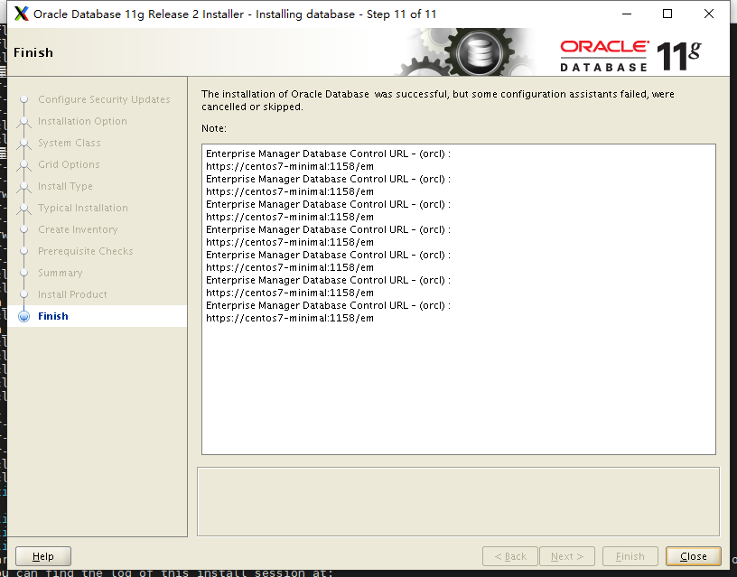


### 16、查看监听状态


```shell
#查看监听状态，监听安装完默认是启动的
[oracle@centos7l database]$ lsnrctl status
LSNRCTL for Linux: Version 11.2.0.1.0 - Production on 29-SEP-2019 16:40:50
Copyright (c) 1991, 2009, Oracle.  All rights reserved.
Connecting to (DESCRIPTION=(ADDRESS=(PROTOCOL=IPC)(KEY=EXTPROC1521)))
STATUS of the LISTENER
------------------------
Alias                     LISTENER
Version                   TNSLSNR for Linux: Version 11.2.0.1.0 - Production
Start Date                29-SEP-2019 16:20:15
Uptime                    0 days 0 hr. 20 min. 34 sec
Trace Level               off
Security                  ON: Local OS Authentication
SNMP                      OFF
Listener Parameter File   /home/oracle/app/oracle/product/11.2.0/dbhome_1/network/admin/listener.ora
Listener Log File         /home/oracle/app/oracle/diag/tnslsnr/centos7l/listener/alert/log.xml
Listening Endpoints Summary...
  (DESCRIPTION=(ADDRESS=(PROTOCOL=ipc)(KEY=EXTPROC1521)))
  (DESCRIPTION=(ADDRESS=(PROTOCOL=tcp)(HOST=192.168.131.7)(PORT=1521)))
Services Summary...
Service "orcl" has 1 instance(s).
  Instance "orcl", status READY, has 1 handler(s) for this service...
Service "orclXDB" has 1 instance(s).
  Instance "orcl", status READY, has 1 handler(s) for this service...
The command completed successfully

#如果监听没有启动，可以通过下列命令启动
[oracle@centos7l ~]$ lsnrctl start
LSNRCTL for Linux: Version 11.2.0.1.0 - Production on 29-SEP-2019 21:52:32

Copyright (c) 1991, 2009, Oracle.  All rights reserved.

Starting /home/oracle/app/oracle/product/11.2.0/dbhome_1/bin/tnslsnr: please wait...

TNSLSNR for Linux: Version 11.2.0.1.0 - Production
System parameter file is /home/oracle/app/oracle/product/11.2.0/dbhome_1/network/admin/listener.ora
Log messages written to /home/oracle/app/oracle/diag/tnslsnr/centos7l/listener/alert/log.xml
Listening on: (DESCRIPTION=(ADDRESS=(PROTOCOL=ipc)(KEY=EXTPROC1521)))
Listening on: (DESCRIPTION=(ADDRESS=(PROTOCOL=tcp)(HOST=192.168.131.7)(PORT=1521)))

Connecting to (DESCRIPTION=(ADDRESS=(PROTOCOL=IPC)(KEY=EXTPROC1521)))
STATUS of the LISTENER
------------------------
Alias                     LISTENER
Version                   TNSLSNR for Linux: Version 11.2.0.1.0 - Production
Start Date                29-SEP-2019 21:52:34
Uptime                    0 days 0 hr. 0 min. 0 sec
Trace Level               off
Security                  ON: Local OS Authentication
SNMP                      OFF
Listener Parameter File   /home/oracle/app/oracle/product/11.2.0/dbhome_1/network/admin/listener.ora
Listener Log File         /home/oracle/app/oracle/diag/tnslsnr/centos7l/listener/alert/log.xml
Listening Endpoints Summary...
  (DESCRIPTION=(ADDRESS=(PROTOCOL=ipc)(KEY=EXTPROC1521)))
  (DESCRIPTION=(ADDRESS=(PROTOCOL=tcp)(HOST=192.168.131.7)(PORT=1521)))
The listener supports no services
The command completed successfully

```


## 五、安装及连接遇到的问题解决

### ORA-12170:TNS:连接超时

```shell
查看linux系统的防火墙是否关闭，或者数据库端口是否开放
firewall-cmd --permanent --zone=public --add-port=1521/tcp
firewall-cmd --reload
firewall-cmd --zone=public --list-ports

```

### ORA-12514 TNS 监听程序当前无法识别连接描述符中请求服务

```shell
#打开文件夹
[oracle@centos7l database]$ cd /home/oracle/app/oracle/product/11.2.0/dbhome_1/network/admin
[oracle@centos7l admin]$ ls
listener.ora  samples  shrept.lst  shellnet.ora  tnsnames.ora

#修改listener.ora，这是修改前的
[oracle@centos7l admin]$ vi listener.ora
# listener.ora Network Configuration File: /home/oracle/app/oracle/product/11.2.0/dbhome_1/network/admin/listener.ora
# Generated by Oracle configuration tools.

LISTENER =
  (DESCRIPTION_LIST =
    (DESCRIPTION =
      (ADDRESS = (PROTOCOL = IPC)(KEY = EXTPROC1521))
      (ADDRESS = (PROTOCOL = TCP)(HOST = centos7l)(PORT = 1521))
    )
  )

ADR_BASE_LISTENER = /home/oracle/app/oracle

#修改后的，192.168.211.42是我虚拟机的ip
[oracle@centos7l admin]$ cat listener.ora
# listener.ora Network Configuration File:/home/oracle/app/oracle/product/11.2.0/dbhome_1/network/admin/listener.ora
# Generated by Oracle configuration tools.

SID_LIST_LISTENER =
  (SID_LIST =
    (SID_DESC =
      (GLOBAL_DBNAME = orcl)
      (ORACLE_HOME = /home/oracle/app/oracle/product/11.2.0/dbhome_1)
      (SID_NAME = orcl)
    )
  )

LISTENER =(DESCRIPTION = (ADDRESS = (PROTOCOL = TCP)(HOST = centos7)(PORT = 1521)))
ADR_BASE_LISTENER = /home/oracle/app/oracle


#修改tnsnames.ora，这是修改前的
[oracle@centos7l admin]$ vi tnsnames.ora
# tnsnames.ora Network Configuration File: /home/oracle/app/oracle/product/11.2.0/dbhome_1/network/admin/tnsnames.ora
# Generated by Oracle configuration tools.

ORCL =
  (DESCRIPTION =
    (ADDRESS = (PROTOCOL = TCP)(HOST = centos7l)(PORT = 1521))
    (CONNECT_DATA =
      (SERVER = DEDICATED)
      (SERVICE_NAME = orcl)
    )
  )

#修改后的
[oracle@centos7l admin]$ cat tnsnames.ora
# tnsnames.ora Network Configuration File: /home/oracle/app/oracle/product/11.2.0/dbhome_1/network/admin/tnsnames.ora
# Generated by Oracle configuration tools.

orcl =
  (DESCRIPTION =
    (ADDRESS_LIST =
      (ADDRESS = (PROTOCOL = TCP)(HOST = centos7l)(PORT = 1521))
    )
    (CONNECT_DATA =
      (SID = orcl)
    )
  )
  
#关闭监听服务，有时候关闭不了，提示没有权限操作监听服务，解决方法下一个问题
[oracle@centos7l admin]$ lsnrctl stop 

LSNRCTL for Linux: Version 11.2.0.1.0 - Production on 04-MAR-2019 16:25:32

Copyright (c) 1991, 2009, Oracle.  All rights reserved.

Connecting to (DESCRIPTION=(ADDRESS=(PROTOCOL=TCP)(HOST=192.168.211.42)(PORT=1521)))
The command completed successfully

#开启监听服务
[oracle@centos7l admin]$ lsnrctl start

LSNRCTL for Linux: Version 11.2.0.1.0 - Production on 04-MAR-2019 16:27:20

Copyright (c) 1991, 2009, Oracle.  All rights reserved.

Starting /home/oracle/app/oracle/product/11.2.0/dbhome_1/bin/tnslsnr: please wait...

TNSLSNR for Linux: Version 11.2.0.1.0 - Production
System parameter file is /home/oracle/app/oracle/product/11.2.0/dbhome_1/network/admin/listener.ora
Log messages written to /home/oracle/app/oracle/diag/tnslsnr/centos7l/listener/alert/log.xml
Listening on: (DESCRIPTION=(ADDRESS=(PROTOCOL=tcp)(HOST=192.168.211.42)(PORT=1521)))

Connecting to (DESCRIPTION=(ADDRESS=(PROTOCOL=TCP)(HOST=192.168.211.42)(PORT=1521)))
STATUS of the LISTENER
------------------------
Alias                     LISTENER
Version                   TNSLSNR for Linux: Version 11.2.0.1.0 - Production
Start Date                04-MAR-2019 16:27:20
Uptime                    0 days 0 hr. 0 min. 0 sec
Trace Level               off
Security                  ON: Local OS Authentication
SNMP                      OFF
Listener Parameter File   /home/oracle/app/oracle/product/11.2.0/dbhome_1/network/admin/listener.ora
Listener Log File         /home/oracle/app/oracle/diag/tnslsnr/centos7l/listener/alert/log.xml
Listening Endpoints Summary...
  (DESCRIPTION=(ADDRESS=(PROTOCOL=tcp)(HOST=192.168.211.42)(PORT=1521)))
Services Summary...
Service "orcl" has 1 instance(s).
  Instance "orcl", status UNKNOWN, has 1 handler(s) for this service...
The command completed successfully

#登入
[oracle@centos7l admin]$ shellplus / as sysdba

shell*Plus: Release 11.2.0.1.0 Production on Mon Mar 4 16:27:54 2019

Copyright (c) 1982, 2009, Oracle.  All rights reserved.


Connected to:
Oracle Database 11g Enterprise Edition Release 11.2.0.1.0 - 64bit Production
With the Partitioning, OLAP, Data Mining and Real Application Testing options

shell> 

#立即关闭数据库服务
shell> shutdown immediate
Database closed.
Database dismounted.
ORACLE instance shut down

#开启数据库服务
shell> startup
ORACLE instance started.

Total System Global Area  764121088 bytes
Fixed Size                  2217264 bytes
Variable Size             452987600 bytes
Database Buffers          301989888 bytes
Redo Buffers                6926336 bytes
Database mounted.
Database opened.

#注册
shell> alter system register;   
System altered.

```

PS：一步都不要少，其实对于修改的这两个文件内容，我猜在配置应答文件的时候配错了，应该直接将我们修改的这些在配置应答文件就配置到对应的地方，不过没有实验，我也是按照别人的博文一步一步来，怕出错不知道怎么修改，到此本地window可以连接数据库了。

- TNS-01190: The user is not authorized to execute the requested listener command

在执行lsnrctl stop 命令时，提示没有权限操作监听服务，原因时当前用户不是启动监听的用户，切换到启动监听服务的用户下执行lsnrctl stop 命令就可以了，因为启动监听服务的用户拥有所有权，其他用户不能操作

- 执行lsnrctl stop或者lsnrctl stop，提示lsnrctl: 未找到命令

切换到oracle用户的时候执行的是 su oracle，正确的是su - oracle

- ORA-01031: insufficient privileges

执行shellplus / as sysdba命令时提示该错误，可以先先切换到别的用户环境下，再切换回来试试。

- 本地window连接没有问题，但是其他人无法连接

检查以下是否能ping通，网络用桥接模式，不然别人ping不通，我用的是NAT模式，导致只能本地连接，别人连接不了我虚拟机的数据库。这种模式下如何ping通我没有查。

- ora-01950:对表空间XXX无权限

在创建表的时候，插入数据提示无权限

```shell
#username 换成没有权限的用户
grant  resource to username
```


## 六、设置数据库自启动


### 1、使用Oracle用户修改两个文件

```shell
[oracle@centos7 dbs]$ vim $ORACLE_HOME/bin/dbstart
#将
ORACLE_HOME_LISTNER=$1
#修改为：
ORACLE_HOME_LISTNER=$ORACLE_HOME

[oracle@centos7 dbs]$ vim $ORACLE_HOME/bin/dbshut
#将
ORACLE_HOME_LISTNER=$1
#修改为：
ORACLE_HOME_LISTNER=$ORACLE_HOME
```


###  2、修改/etc/oratab文件

```shell
[oracle@centos7 dbs]$ vim /etc/oratab

#找到：    
orcl:/home/oracle/app/oracle/product/11.2.0/dbhome_1:N   
#修改为：  
orcl:/home/oracle/app/oracle/product/11.2.0/dbhome_1:Y
```


### 3、新建Oracle服务自启动脚本

切换到root用户

```shell
[root@centos7l ~]# vim /etc/init.d/oracle
```

- 将以下脚本复制到文件中，保存退出

  

```shell
#!/bin/sh

# chkconfig: 2345 61 61

# description: Oracle 11g R2 AutoRun Servimces

# /etc/init.d/oracle

#

# Run-level Startup script for the Oracle Instance, Listener, and

# Web Interface

export ORACLE_BASE=/home/oracle/app/oracle #根据个人情况修改路径
export ORACLE_HOME=$ORACLE_BASE/product/11.2.0/dbhome_1
export ORACLE_SID=orcl #改成自己的ORACLE_SID:testsid
export PATH=$PATH:$ORACLE_HOME/bin
ORA_OWNR="oracle"

# if the executables do not exist -- display error

if [ ! -f $ORACLE_HOME/bin/dbstart -o ! -d $ORACLE_HOME ]
then
echo "Oracle startup: cannot start"
exit 1
fi

# depending on parameter -- startup, shutdown, restart

# of the instance and listener or usage display

case "$1" in
start)

# Oracle listener and instance startup

su $ORA_OWNR -lc $ORACLE_HOME/bin/dbstart
echo "Oracle Start Succesful!OK."
;;
stop)

# Oracle listener and instance shutdown

su $ORA_OWNR -lc $ORACLE_HOME/bin/dbshut
echo "Oracle Stop Succesful!OK."
;;
reload|restart)
$0 stop
$0 start
;;
*)
echo $"Usage: `basename $0` {start|stop|restart|reload}"
exit 1
esac
exit 0

```


### 4、更改oracle脚本的执行权限

```shell
[root@localhost oracle]# chmod a+x /etc/init.d/oracle
```


### 5、检查脚本能否执行

```shell
[root@localhost oracle]# /etc/init.d/oracle start         #启动oracle脚本
[root@localhost oracle]# /etc/init.d/oracle stop          #关闭oracle脚本
[root@localhost oracle]# /etc/init.d/oracle restart       #重启oracle脚本
```


### 6、添加执行权限并建立链接

建立链接将启动脚本添加到系统服务并设置自启动

```shell
[root@localhost oracle]# chkconfig --add oracle

#ps 找不到命令的系统请安装chkconfig

yum install chkconfig -y
```

ps:当这个命令被执行的时候，会去脚本文件oracle中寻找# chkconfig: 2345 61 61这行注释，并解析这行注释，根据解析结果分别在

```
/etc/rc.d/rc2.d
/etc/rc.d/rc3.d
/etc/rc.d/rc4.d
/etc/rc.d/rc5.d
```

中创建符号连接文件S61oracle，此文件在系统启动时根据运行级别执行，此文件是指向/etc/init.d/oracle文件。启动时系统向此文件发送一个start参数，执行oracle文件中的start分支。另外还会在

```
/etc/rc.d/rc0.d
/etc/rc.d/rc1.d
/etc/rc.d/rc6.d
```

中创建符号连接文件K61oracle，此文件在系统关闭时执行，此文件也指向/etc/init.d/oracle文件，关闭时系统向此文件发送一个stop参数，执行oracle文件中的stop分支。

chkconfig: 2345 61 61

表明脚本应该在运行级 2, 3, 4, 5 启动，启动优先权为61，停止优先权为 61。

修改服务运行等级(虽然脚本里写过，但还是重新设置一下)，可以自行设置oracle脚本的运行级别

```shell
root@localhost oracle]# chkconfig --level 2345 oracle on
```

说明：设置oracle脚本在运行级别为2、3、4、5时，都是on（开启）状态，off为关闭


### 7、查看oracle自动启动设置

```shell
[root@localhost oracle]# chkconfig --list oracle
oracle          0:关    1:关    2:开    3:开    4:开    5:开    6:关
#等级0表示：表示关机
#等级1表示：单用户模式
#等级2表示：无网络连接的多用户命令行模式
#等级3表示：有网络连接的多用户命令行模式
#等级4表示：不可用
#等级5表示：带图形界面的多用户模式
#等级6表示：重新启动
```


### 8、手动创建符号链接文件

- `（执行效果和执行chkconfig --add oracle是一样，作为知识笔记记录，可以不执行）`

```shell
[root@localhost oracle]# ln –s /etc/rc.d/init.d/oracle /etc/rc0.d/K61oracle
[root@localhost oracle]# ln –s /etc/rc.d/init.d/oracle /etc/rc1.d/K61oracle
[root@localhost oracle]# ln –s /etc/rc.d/init.d/oracle /etc/rc2.d/S61oracle
[root@localhost oracle]# ln –s /etc/rc.d/init.d/oracle /etc/rc3.d/S61oracle
[root@localhost oracle]# ln –s /etc/rc.d/init.d/oracle /etc/rc4.d/S61oracle
[root@localhost oracle]# ln –s /etc/rc.d/init.d/oracle /etc/rc5.d/S61oracle
[root@localhost oracle]# ln –s /etc/rc.d/init.d/oracle /etc/rc6.d/K61oracle

```

### 9、oracle的启动或关闭管理

```shell
#启动
[root@localhost oracle]# service oracle start
#停止
[root@localhost oracle]# service oracle stop
#重启
[root@localhost oracle]# service oracle restart

```

## 七、数据库字符集修改

PS:没有操作过，从参考文档摘过来的

注意事项：修改字符集前先将数据库进行备份

此处演示将ZHS16GBK字符集修改为AL32UTF8

### 1、修改server端字符集

登录shellpus查看字符集设置

```shell
[oracle@localhost ~]$ sqlplus /nolog
sql*Plus: Release 11.2.0.1.0 Production on Wed Jan 24 13:55:51 2018
Copyright (c) 1982, 2009, Oracle.  All rights reserved.
sql> conn /as sysdba
Connected to an idle instance.                  #数据库未启动，先启动数据库。最好将数据库设未开机启动
sql> startup
sql> conn /as sysdba
Connected.                                      #连接成功
sql> select userenv('language') from dual;      #server端字符集查询


USERENV('LANGUAGE')
----------------------------------------------------
AMERICAN_AMERICA.ZHS16GBK

```

依次执行如下命令

```shell
shell>SHUTDOWN IMMEDIATE;
shell>STARTUP MOUNT;
shell>ALTER SYSTEM ENABLE RESTRICTED SESSION;
shell>ALTER SYSTEM SET JOB_QUEUE_PROCESSES=0;
shell>ALTER SYSTEM SET AQ_TM_PROCESSES=0;
shell>ALTER DATABASE OPEN;
shell>ALTER DATABASE CHARACTER SET INTERNAL_USE AL32UTF8;
shell>SHUTDOWN IMMEDIATE;
shell>STARTUP;

shell> select userenv('language') from dual;
USERENV('LANGUAGE')
----------------------------------------------------
AMERICAN_AMERICA.AL32UTF8
shell> 

```

### 2、修改client端字符集

查看系统环境变量设置的字符集(client端字符集)

```shell
[oracle@localhost ~]$ cat /home/oracle/.bash_profile
...
PATH=$PATH:$HOME/.local/bin:$HOME/bin
export PATH

export ORACLE_BASE=/home/oracle/app/oracle
export ORACLE_HOME=$ORACLE_BASE/product/11.2.0/dbhome_1
export ORACLE_SID=orcl
export ORACLE_TERM=xterm
export PATH=$ORACLE_HOME/bin:/usr/sbin:$PATH
export LD_LIBRARY_PATH=$ORACLE_HOME/lib:/lib:/usr/lib
export LANG=en_US.utf8
export NLS_LANG=AMERICAN_AMERICA.ZHS16GBK                #客户端字符集

进入编辑界面，将ZHS16GBK改为AL32UTF8，保存退出
[oracle@localhost ~]$ vim /home/oracle/.bash_profile
使配置生效
[oracle@localhost ~]$ source /home/oracle/.bash_profile

```

[参考文档]

[https://docs.oracle.com/cd/E11882_01/install.112/e47689/toc.htm(官网)](https://docs.oracle.com/cd/E11882_01/install.112/e47689/toc.htm(%E5%AE%98%E7%BD%91))

<https://blog.csdn.net/lqdyx/article/details/78999761>

<https://www.cnblogs.com/nichoc/p/6417505.html>

<https://www.cnblogs.com/VoiceOfDreams/p/8308601.html>